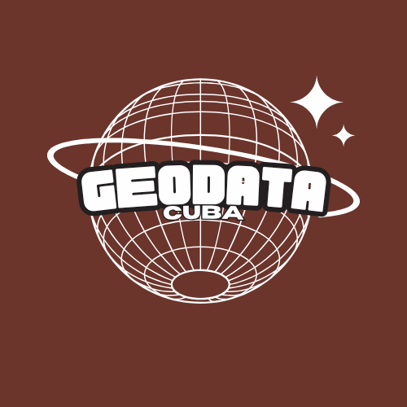

# Atlas-Sismo
### *Proyecto sobre Sismología en Cuba de la carrera Ciencia de Datos*
#### Integrantes:
- David Michel García Batista
- Mariam Parra Cárdenas

### Cuba es un laboratorio geológico natural. Está en la intersección de placas tectónicas. rodeado de fallas activas, con una actividad sísmica constante y fascinante
### Estos patrones están ahí, esperando. Pero están enterrados en miles de registros dispersos, en formatos diferentes, sin herramientas que permitan explotarlos intuitivamente
## ¿Cómo hacemos visible lo invisible? ¿Cómo convertimos números en insights? 

### Contenido:
- [Analisis](main.py)
- [Biblioteca_personal](analysis.py)
- [Video]()
- [Red_Social](https://www.instagram.com/geodatacuba?igsh=MTZvbjg2MTc0c3Blbw%3D%3D&utm_source=qr)
- [Requerimientos](requirements.txt)